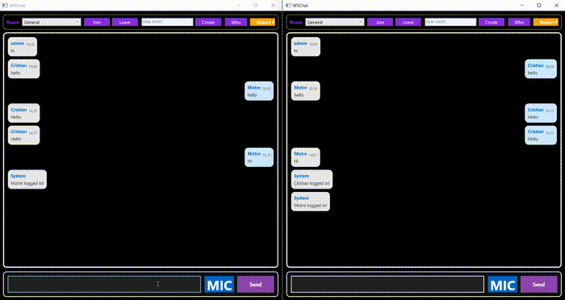

# WSChat 💬

Навчальний клієнт-серверний чат, розроблений у рамках курсової роботи. Проєкт побудований за принципами Clean Architecture з розділенням на шари Domain, Application, Infrastructure.

## 🏗 Архітектура

Проєкт розбитий на окремі шари для розділення відповідальності:

- **WSChat.Domain** — бізнес-сутності та інтерфейси
- **WSChat.Application** — бізнес-логіка та use cases
- **WSChat.Infrastructure** — реалізація доступу до даних (EF Core, SQLite)
- **WSChat.Server** — серверна частина (WebSocket handling)
- **WSChat.Client** — клієнтський застосунок
- **WSChat.Shared** — спільні моделі та DTO між клієнтом і сервером

## ⚙️ Технології

- C# / .NET
- WebSocket — обмін повідомленнями в реальному часі
- SQLite + Entity Framework Core — зберігання даних

## ✨ Можливості

- Підключення до сервера в реальному часі
- Обмін повідомленнями між користувачами
- Керування користувачами
- Збереження історії повідомлень у базі даних

## 🎯 Мета проєкту

Курсова робота для практики розробки клієнт-серверних застосунків, роботи з мережевими технологіями та архітектурними патернами.
